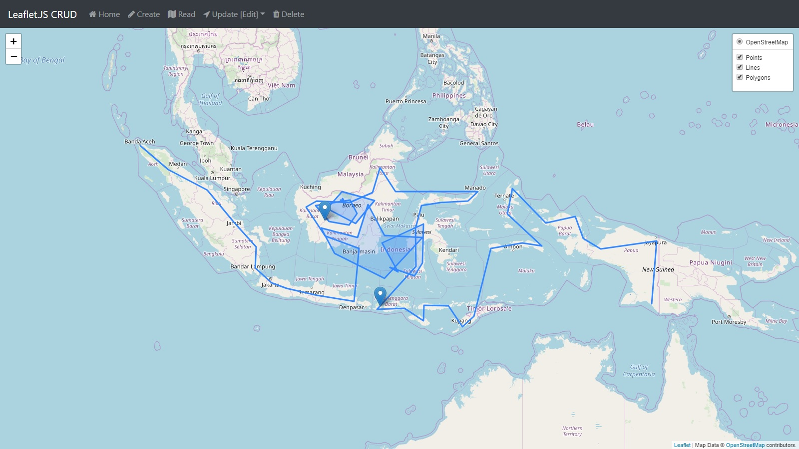

# leaflet-CRUD
Leaflet.JS CRUD Implementation to PostgreSQL/PostGIS

This project uses [Leaflet](https://github.com/Leaflet/Leaflet), [Leaflet.Draw](https://github.com/Leaflet/Leaflet.draw), [ESRI Terraformer Core](http://terraformer.io/core/) and [ESRI Terraformer WKT Parser](http://terraformer.io/wkt-parser/); while at the backend it uses [PHP](http://php.net/) and [PostgreSQL](https://www.postgresql.org/)/[PostGIS](https://postgis.net/).

